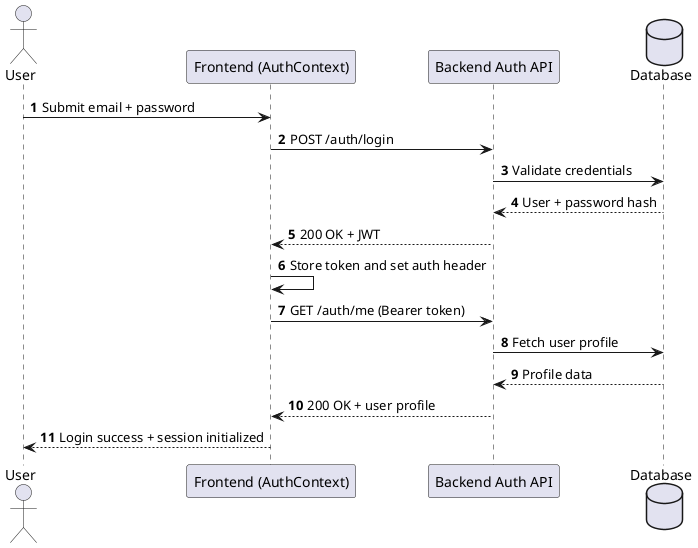
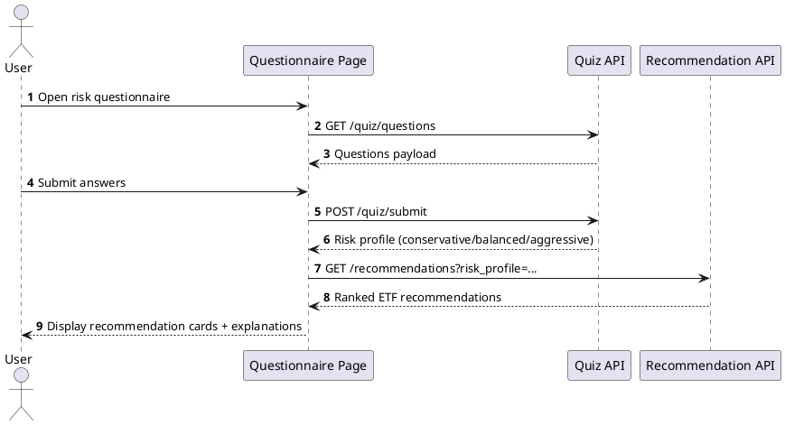
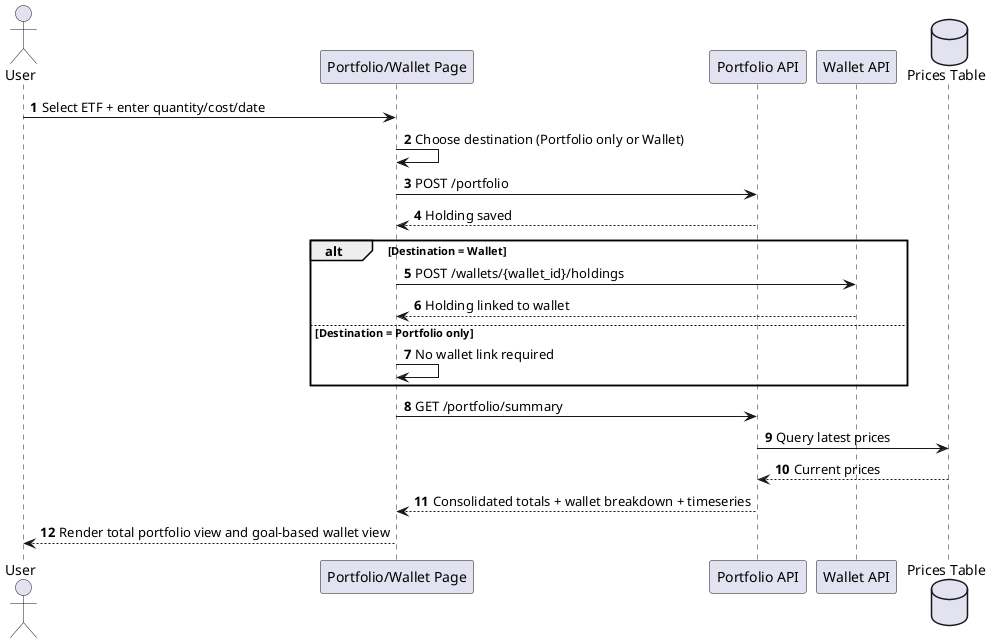
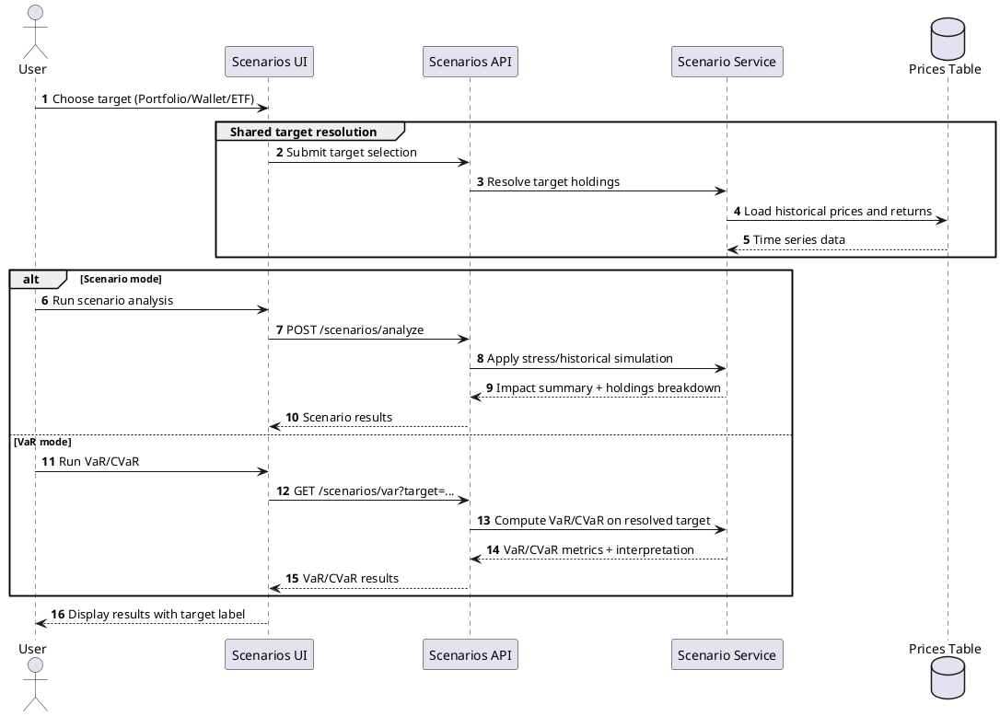
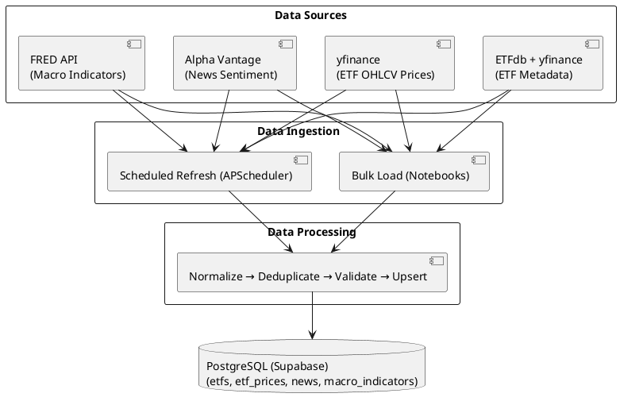

# UML and Diagram Notes (Cross-Checked with Current Implementation)

This file records each diagram that should be included or updated based on the current backend and frontend implementation.

## 1) Use Case Diagram - done 
- Status: Exists in report (Chapter 3 reference).
- Keep: Retail investor core flows (auth, quiz, ETF discovery, recommendations, portfolio, scenario analysis, chatbot).
- Update:
	- Add Wallet management use cases (create wallet, update wallet profile, assign holdings to wallet, deactivate wallet).
	- Add Scenario target options (analyze by full portfolio, single wallet, or single ETF).
	- Clarify that ETF discovery and ETF detail viewing are available without login, while portfolio/wallet/scenario/chatbot are authenticated features.

## 2) System Architecture Diagram - done 
- Status: Exists in report (Chapter 3 reference).
- Keep: 3-tier architecture (Next.js frontend, FastAPI backend, PostgreSQL).
- Update:
	- Add explicit external integrations:
		- OpenAI (chatbot)
		- Alpha Vantage (news sentiment)
		- yfinance / ETF metadata sources (market data)
	- Add background scheduler component in backend (daily top ETF news refresh job).
	- Show deployment split (Frontend on Vercel, Backend on Render, DB on Supabase) if not already shown.

## 3) ER Diagram (Database Schema)
- Status: Exists in report (Chapter 3 reference).
- Keep: Core entities (users, etfs, etf_prices, macro_indicators, portfolios, news, news_tickers).
- Update:
	- Add wallet entities now implemented:
		- wallets
		- wallet_profiles
		- wallet_holdings
	- Add/confirm relationships:
		- users 1..* wallets
		- wallets 1..1 wallet_profiles
		- wallets 1..* wallet_holdings
		- wallet_holdings *..1 etfs
		- portfolios *..1 users and *..1 etfs
		- news_tickers *..1 news

## 4) Sequence Diagram: Login and Auth Session
- Status: Should be added if not present.
- Participants:
	- User
	- Frontend (AuthContext)
	- Backend Auth API
	- Database
- Flow:
	1. Login request.
	2. Credential validation.
	3. JWT issuance.
	4. Frontend stores token and sets auth header.
	5. Frontend validates token using profile endpoint.

### PlantUML (Login and Auth Session)

## 5) Sequence Diagram: Risk Quiz to Recommendation
- Status: Should be added if not present.
- Participants:
	- User
	- Questionnaire page
	- Quiz API
	- Recommendation API
- Flow:
	1. Load quiz questions.
	2. Submit answers.
	3. Receive risk profile result.
	4. Load recommendation list by profile.
	5. Render explanation cards.

### PlantUML (Risk Quiz to Recommendation)

## 6) Sequence Diagram: Portfolio and Wallet Workflow
- Status: Should be added if not present.
- Participants:
	- User
	- Portfolio page / Wallet page
	- Portfolio API
	- Wallet API
	- Prices table
- Flow:
	1. Select ETF and enter holding details.
	2. Choose destination: total portfolio only, or a specific wallet.
	3. Save holding to portfolio.
	4. If wallet destination is selected, link holding to that wallet.
	5. Refresh valuation from latest prices.
	6. Display consolidated portfolio totals and wallet-level breakdown.

### PlantUML (Portfolio and Wallet Workflow)

## 7) Sequence Diagram: Scenario Analysis and VaR
- Status: Should be added if not present.
- Participants:
	- User
	- Scenarios UI
	- Scenarios API
	- Scenario service
	- Prices table
- Flow:
	1. Select analysis target (portfolio, wallet, or ETF).
	2. Resolve target holdings using one shared target resolver.
	3. Load historical prices/returns for that target.
	4. If scenario mode is selected, run stress/historical simulation and return impact.
	5. If VaR mode is selected, compute VaR/CVaR and return downside-risk metrics.
	6. Display results with explicit target label.

### PlantUML (Scenario Analysis and VaR)

## 8) Component Diagram: Frontend Modules
- Status: Recommended to add.
- Components:
	- AppShell, Header, AuthContext, API client, ETF pages, Portfolio page, Wallet page, Scenarios page, News components.
- Key dependency notes:
	- AuthContext injects token into API client.
	- Portfolio and Wallet pages share holdings and wallet assignment behavior.

## 9) Component Diagram: Backend Modules
- Status: Recommended to add.
- Components:
	- Routes (auth, etfs, prices, metrics, recommendations, portfolio, wallets, news, scenarios, chatbot, quiz)
	- Services (metrics, scenario_service, news_service)
	- Database models and session layer.

## 10) Activity Diagram: Data Pipeline Flowchart
- Status: Recommended to add (supports Chapter 4.2).
- Scope:
	- Metadata ingestion (ETF metadata sources)
	- OHLCV ingestion and incremental updates
	- News sentiment ingestion with rate-limit-aware batching
	- Validation, normalization, deduplication, and database upsert
	- Scheduler path (daily news refresh) and script path (incremental OHLCV refresh)

### PlantUML (Data Pipeline Flowchart)

## 11) Ready-to-Use UML Use Case Diagram (PlantUML)

Use this directly in your report toolchain or UML editor.

		@startuml
		left to right direction
		skinparam packageStyle rectangle

		actor "Retail Investor" as Investor
		actor "Authentication System\n(JWT + Password Hashing)" as AuthSystem
		actor "Application Services\n(Market Data + News Sentiment + LLM)" as AppServices

		rectangle "ETF Recommendation Platform" {
			usecase "Register Account" as UC_Register
			usecase "Login" as UC_Login
			usecase "Update Profile" as UC_Profile

			usecase "Take Risk Questionnaire" as UC_Quiz
			usecase "Get ETF Recommendations" as UC_Recommend

			usecase "Browse/Search ETFs" as UC_Browse
			usecase "View ETF Details & Metrics" as UC_ETFDetail

			usecase "Manage Portfolio" as UC_Portfolio
			usecase "Manage Wallets\n(Create/Update/Deactivate)" as UC_Wallet
			usecase "Assign Holdings to Wallet" as UC_Assign

			usecase "Run Scenario Analysis\n(Portfolio/Wallet/ETF Target)" as UC_Scenario
			usecase "Calculate VaR/CVaR" as UC_VaR

			usecase "View News & Alerts" as UC_News
			usecase "Ask AI Chatbot" as UC_Chat
		}

		Investor --> UC_Register
		Investor --> UC_Login
		Investor --> UC_Profile
		Investor --> UC_Quiz
		Investor --> UC_Recommend
		Investor --> UC_Browse
		Investor --> UC_ETFDetail
		Investor --> UC_Portfolio
		Investor --> UC_Wallet
		Investor --> UC_Assign
		Investor --> UC_Scenario
		Investor --> UC_VaR
		Investor --> UC_News
		Investor --> UC_Chat

		UC_Register <-- AuthSystem
		UC_Login <-- AuthSystem
		UC_Profile <-- AuthSystem
		UC_Portfolio <-- AuthSystem
		UC_Wallet <-- AuthSystem
		UC_Assign <-- AuthSystem
		UC_Scenario <-- AuthSystem
		UC_VaR <-- AuthSystem
		UC_Chat <-- AuthSystem

		UC_Browse <-- AppServices
		UC_ETFDetail <-- AppServices
		UC_Recommend <-- AppServices
		UC_Portfolio <-- AppServices
		UC_Scenario <-- AppServices
		UC_VaR <-- AppServices
		UC_News <-- AppServices
		UC_Chat <-- AppServices

		UC_Recommend .> UC_Quiz : <<include>>
		UC_Assign .> UC_Wallet : <<include>>
		UC_VaR .> UC_Scenario : <<extend>>

		note right of UC_Browse
			Public access allowed
			in current implementation.
		end note

		note right of UC_Portfolio
			Authenticated access required
			in current implementation.
		end note
		@enduml

## 12) Ready-to-Use ER Diagram (PlantUML)

Use this as the source for `entity_relationship_diagram` and export to `docs/fig/entity_relationship_diagram.png`.

		@startuml
		left to right direction
		skinparam linetype ortho
		hide circle
		hide stereotypes
		skinparam classBackgroundColor white
		skinparam classBorderColor black
		skinparam classArrowColor black

		together {
		  class "users" as users {
		    +id : int <<PK>>
		    --
		    email : string
		    password_hash : string
		    name : string
		    risk_profile : string
		    created_at : datetime
		  }
		
		  class "portfolios" as portfolios {
		    +id : int <<PK>>
		    --
		    user_id : int <<FK>>
		    ticker : string <<FK>>
		    quantity : float
		    purchase_date : date
		    purchase_price : float
		  }
		
		  class "wallets" as wallets {
		    +id : int <<PK>>
		    --
		    user_id : int <<FK>>
		    name : string
		    purpose : string
		    base_currency : string
		    is_active : int
		    created_at : datetime
		    updated_at : datetime
		  }
		
		  class "wallet_profiles" as wallet_profiles {
		    +id : int <<PK>>
		    --
		    wallet_id : int <<FK, UNIQUE>>
		    risk_profile : string
		    horizon_months : int
		    objective : string
		    target_return_min : float
		    target_return_max : float
		    max_drawdown_pct : float
		    liquidity_need : string
		    experience_level : string
		  }
		
		  class "wallet_holdings" as wallet_holdings {
		    +id : int <<PK>>
		    --
		    wallet_id : int <<FK>>
		    ticker : string <<FK>>
		    quantity : float
		    avg_cost : float
		    added_at : datetime
		    updated_at : datetime
		  }
		}

		together {
		  class "etfs" as etfs {
		    +ticker : string <<PK>>
		    --
		    etf_name : string
		    category : string
		    asset_class : string
		    expense_ratio : string
		    aum : string
		    beta : string
		  }
		
		  class "etf_prices" as etf_prices {
		    +id : int <<PK>>
		    --
		    ticker : string <<FK>>
		    date : date
		    open : float
		    high : float
		    low : float
		    close : float
		    volume : bigint
		  }
		
		  class "macro_indicators" as macro_indicators {
		    +id : int <<PK>>
		    --
		    indicator_name : string
		    date : date
		    value : float
		  }
		}

		together {
		  class "news" as news {
		    +id : int <<PK>>
		    --
		    title : text
		    url : string
		    source : string
		    time_published : datetime
		    overall_sentiment_score : float
		    overall_sentiment_label : string
		  }
		
		  class "news_tickers" as news_tickers {
		    +id : int <<PK>>
		    --
		    news_id : int <<FK>>
		    ticker : string
		    ticker_sentiment_score : float
		    ticker_sentiment_label : string
		    relevance_score : float
		  }
		}

		users -[hidden]right-> etfs
		etfs -[hidden]right-> news

		users ||--o{ portfolios : has
		etfs ||--o{ portfolios : includes

		users ||--o{ wallets : owns
		wallets ||--|| wallet_profiles : config
		wallets ||--o{ wallet_holdings : contains
		etfs ||--o{ wallet_holdings : references

		etfs ||--o{ etf_prices : priced_by

		news ||--o{ news_tickers : tagged_with

		@enduml
